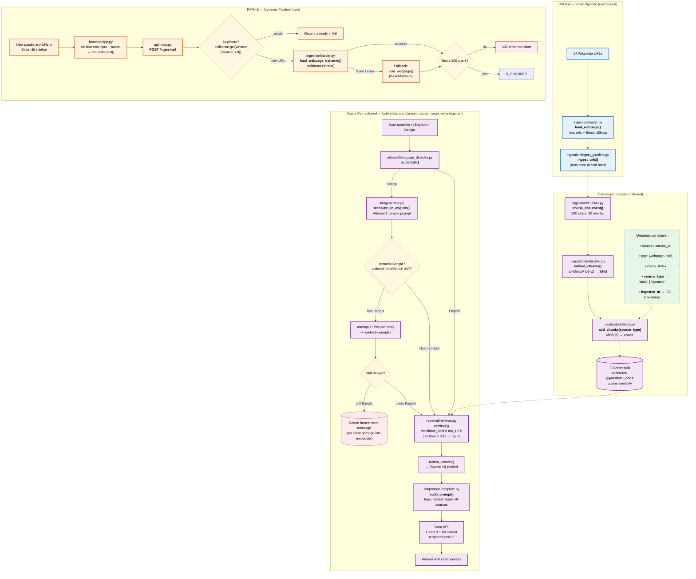

# GyanSetu Architecture Flowchart

This diagram shows the two parallel ingestion pipelines (static and dynamic) converging into a single ChromaDB collection, then flowing through retrieval and answer generation — which now serves both source types equally.

## Legend

| Colour | Meaning |
|---|---|
| 🔵 Blue (`static`) | **Path A** — Static pipeline (unchanged, cold-start only) |
| 🟠 Orange (`dynamic`) | **Path B** — Dynamic URL ingestion (this feature) |
| 🟣 Purple (`shared`) | Shared code — identical for both source types |
| 🟢 Green (dashed) | New metadata fields added for provenance tracking |
| 🔴 Red (`error`) | Error / failure exit |
| 🟡 Yellow (`decision`) | Conditional validation gate |
