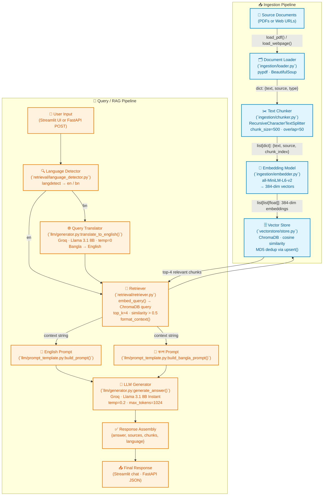

# Gyanshetu — System Flowchart

## Pipeline Overview

| Step | Component | Technology |
|------|-----------|------------|
| **Load** | `ingestion/loader.py` | pypdf, BeautifulSoup, requests |
| **Chunk** | `ingestion/chunker.py` | LangChain RecursiveCharacterTextSplitter (500/50) |
| **Embed** | `ingestion/embedder.py` | sentence-transformers all-MiniLM-L6-v2 |
| **Store** | `vectorstore/store.py` | ChromaDB PersistentClient, cosine similarity, MD5 dedup |
| **Detect** | `retrieval/language_detector.py` | langdetect |
| **Translate** | `llm/generator.py` | Groq — llama-3.1-8b-instant, temp=0 |
| **Retrieve** | `retrieval/retriever.py` | Embed query → ChromaDB similarity search → filter > 0.5 |
| **Generate** | `llm/generator.py` | Groq — llama-3.1-8b-instant, temp=0.2, max_tokens=1024 |
| **API** | `api/main.py` | FastAPI, CORS, Pydantic models |
| **UI** | `frontend/app.py` | Streamlit chat with source links |
